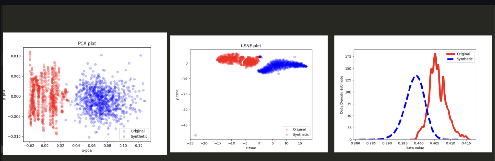
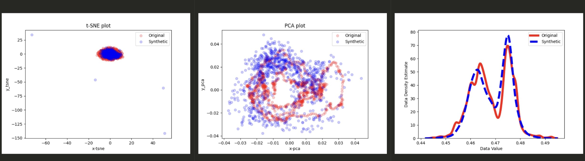

# 项目背景与动机

- **项目概述**：
- Netshare是使用生成对抗网络 (GAN) 自动学习生成模型以生成用于网络任务（例如遥测、异常检测、配置）的合成数据包和流头跟踪。而我的任务是将其GAN方法换为近段时间表现更为出色的Diffusion-TS(扩散模型)
- **动机**：
  - GAN 在时序数据生成中的一些局限性，对于生成超长时间序列的任务，其生成的精确度会越来越低，且生成器和判别器之间的对抗性学习可能会导致训练难以收敛。
  - 扩散模型专门针对捕捉不同时间步之间的时间依赖性，而且扩散模型的生成是“逐步去噪”的过程，不会因为时间序列过长而导致模式崩溃

# 项目目标

- **总体目标**：提高 NetShare 框架生成时序网络流量的能力，并通过将 GAN 替换为 Diffusion-TS 模型来在“生成超长时间序列”的任务上获得更好的生成效果。
- **具体目标**：
  - 生成更加稳定且**更长的**时序数据。
  - 提高生成数据的质量和真实性。
  - 改进训练过程的收敛速度和稳定性。
  - **最后的可视化图像呈现更好的拟合效果**。

# 技术选择

- **- Diffusion-TS**：
  - 扩散模型的核心思想是通过以下两个步骤来进行数据生成：
	  1.	前向扩散过程（Forward Diffusion Process）：逐步将数据添加噪声，最终将数据扰动成高斯噪声。
	  2.	逆向生成过程（Reverse Process）：从噪声中逐步去除噪声，最终重构出与原始数据分布一致的样本。
  - 扩散模型通过在前向扩散过程中将真实数据扰乱为噪声，并在逆向过程中将噪声还原为数据来生成样本。这种逐步去噪的方式可以避免像 GAN 中的失去时间依赖关系的问题，并且生成的样本更具多样性和稳定性。
  - 经过调研，我选择了[Diffusion-TS](https://github.com/Y-debug-sys/Diffusion-TS),Diffusion-TS 是一个基于扩散的框架，该框架包含两部分：序列编码器和可解释解码器，后者将时间序列分解为季节部分和趋势部分；它的特点是训练模型在每个扩散步骤中直接重建样本而不是噪声，并结合基于傅里叶的损失项。

# 项目实施步骤
- **代码修改与集成**：
  - 我并没有直接把Diffusion-TS放进NetShare的代码文件中。首先我需要说明，NetShare的项目实际上分为三个过程：pre_process,GAN,post_process.因此我是保留了NetShare的pre_process和post_process，将预处理的结果输入进Diffusion-TS中，然后再把Diffusion-TS生成的模型进行后处理。
  - 由于pre_process处理后的数据是一个包含了`data_feature`,`data_flag`,`data_field`的npy文件，而Diffusion-TS的输入要求是csv文件（当然也可以换其他文件以及对应的读取方式），然而npy文件实际上是经过了一些不必要的预处理，比如用groupby函数进行分类等等，而之所以其中包含了三个数据块其实是为了post_process里逆归一化。因此我修改了pre_process中的一部分，**保留了其中将字符进行one-hot编码、词嵌入等部分**，**同时注释掉了部分分组的代码直接生成csv文件**。

- **数据处理**：
  - 数据处理我基本保留了NetShare的模型的word_embed等处理，但是Diffusion-TS也有对数据的归一化（在生成dataloader时进行），所以我分别尝试了只保留NetShare和只保留Diffusion-TS的归一化，最后vitualization出的图像明显在后者效果更好，下面为两者的图片： 
  - 对于post_process，主要是对生成的数据进行逆归一化，同样也遇到了数据格式不同的问题，我本来的想法是自己照着其逆归一化过程写一个适合Diffusion-TS输出数据的逆归一化过程，但是后来仔细看了一下代码结果之后发现可以直接套进去（这部分花了我不少时间因为之前一直以为在数据规模不同时不可直接生成）。

- **模型训练**：
  - 模型本身是非自回归的，但是由于我们的需求是生成超长时间序列，因此必须实现自回归预测，对此我与作者进行讨论并且一致认为，可以使用模型的`predict`模式在外部进行自回归。具体来说，是先在`unconstrained`模式下进行采样生成原始的数据，然后在`predict`模式下，每次用最后400步的数据来预测后100步的数据，预测之后再把预测出的100个时间步数据接到ans_data中，如此设置循环次数即可实现超长时间序列的生成。
  - 超参数我基本保留作者的参数，但是提高了decode和encoder的层数，并且增加了训练的epoch数。
  - 我选择的硬件环境是在cloudlab上的DGL 1.1 + PyTorch 2.1 + CUDA 12.1 + Ubuntu 22.04 + c240g5。对于一个windows为500时间步的模型，我的训练时间大约为16h，在可接受范围内。

# 挑战与解决方案

- **技术挑战**：
  1. 因为两个模式输入输出的数据格式不同，所以在数据处理上是有一些麻烦，必须让DIffusion-TS的输入与pre_process的输出兼容，以及其输出与post_process兼容，其中主要是word_embed及其逆过程
  2. 该Diffusion-TS与我预想的不一样，不具备自回归的生成功能，但是有`predict`模式，必须基于此来进行长时间序列的生成
  3. 在循环预测时，每次要更新test_data，但是直接对dataloader进行操作会比较麻烦。同时，我们只需要一条时间序列而不需要多条，多条反而会降低我们的生成时间
  - 

- **解决方案**：
  1. 用python中的inspect函数直接输出源码，从而根据这些底层代码来自己编写pre_process及post_process的部分，使得其输入输出在格式上兼容
  2. 在模型外进行自回归调用，每次都在`predict`模式进行预测，可以捕捉中等长度的时间序列特征，但是长时间序列的特征可能会丧失。
  3. 我通过在模型中生成一个中间临时数据文件，每次循环之前调用dataloader的构造函数，使得其在进行预测前将test_data设置为那个中间临时数据文件（即400个时间步），再将最后的100步致零

# 实验与结果

- **结果对比**：
  - 对比 Diffusion-TS 模型和原始 GAN 模型在时序数据生成中的表现。包括：[（请见文件）](Diffusion-TS/generate.pdf)
    - 生成数据的质量：NetShare自带的可视化对比函数中，将生成的数据分布与raw data的数据分布进行对比，主要包括了byt，dstip，dstport，pkt，proto，srcip，srcport，td，ts这几个特征值，相比GAN来说，Diffusion-TS的拟合效果更好，尤其是pkt，byt，srcip这三个特征值，当然也有和GAN一样的效果不佳的特征值如proto。
    - 生成数据的稳定性：Diffusion-TS的一大优势就是在生成的时间序列增长时不会模式崩溃而导致数据质量变差，我截取了不同长度下的可视化图像并且整合在一起，事实证明Diffusion-TS生成的数据随着时间序列长度增加，其数据分布保持稳定
    - 模型训练的收敛速度较快，最后的loss可以减少至0.01以下、训练时长稳定在16h，生成的时长为400个时间步/五分钟。

# 结论与收获

- **结论**：
  - Diffusion-TS 模型在时序数据生成中的可以进行可控的时间序列生成，同时收敛效果更加，生成的数据拟合效果更好，在长序列任务中体现出更佳的稳定。

- **个人收获**：
  - 此前对机器学习只有理论上的认识，经历了这次之后我对机器学习的代码更加熟悉，也对预处理、训练、后处理不同模块有了新的认识。对于数据处理，我也学会了如何处理npy等数据文件，以及如何整合。
  - 了解了扩散模型的基本原理，数学证明，及其应用。

# 总结与展望
- 进一步优化模型：尽管 Diffusion-TS 在时序数据生成上表现出了优越性，但仍有部分特征（如 proto）生成效果不理想。未来可以尝试通过调整模型结构、增加编码器层数、优化损失函数等手段，进一步提高这些特征的生成效果。
- 模型扩展：目前的实验是基于特定的网络流量数据，未来可以将 Diffusion-TS 模型应用于更广泛的时序数据生成任务中，如股票价格预测、天气数据生成、流行病传播预测等。通过不断扩展模型的应用场景，可以更全面地验证其在各类时序数据生成中的表现。
- 更多生成模型对比：除了 GAN 和 Diffusion-TS，未来可以尝试其他生成模型，如基于变分自编码器（VAE）或流模型（Flow-based Models），并进行详细的对比分析，找到更加适合特定场景的生成方法。
- 优化生成效率：尽管 Diffusion-TS 在生成质量上优于 GAN，但其生成效率还可以进一步提升。可以考虑对模型进行轻量化优化，或者利用分布式计算加速训练和生成过程。
- 在工业领域的应用：随着生成模型在时序数据生成任务中的成熟，其潜在的应用场景越来越广阔。未来可以探索如何将 Diffusion-TS 应用到工业中的数据生成任务，例如网络安全中的流量生成、物联网设备数据模拟、金融数据预测等。
